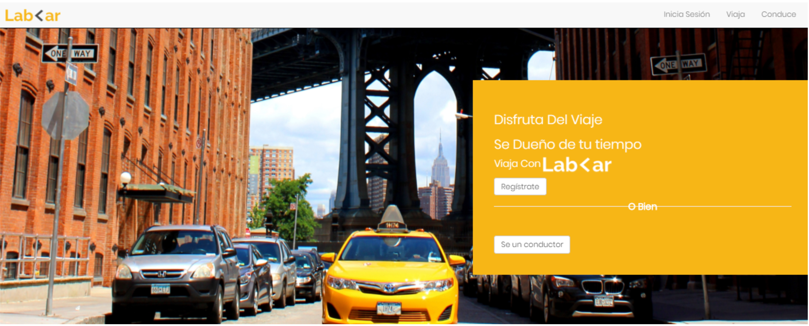

# LabCar  
Layout challenge with BEM methodology

## Indice
- [LabCar](#labcar)
  - [Indice](#indice)
    - [Information:](#information)
    - [Description:](#description)
    - [Final Design:](#final-design)
    - [Reference Images](#reference-images)
    - [Structure:](#structure)
    - [Technologies used:](#technologies-used)
*** 
### Information:
  ***Theme:*** css layout  
  ***Autor:*** Andu15  
  ***Created:*** 06/22
  ***Version:*** 1.0.0  

### Description: 
This repository aims to challenge my knowledge to obtain a replica of a reference image
Remark: the reference image does not belong to me

### Final Design:
- [Figma](https://www.figma.com/file/7giUjZRNWbngN0YDV83mF3/lab-car-boilerplate)

### Reference Images

Note: the credits to whom it corresponds

### Structure:
<pre>
├── assets/
|   ├── boilerplate/
|   ├── final/
|   └── images/
├── css/
├── js/
|   └── app.js
├── .gitignore
├── index.html
└── README.md
</pre>

### Technologies used:
- HTML
- CSS
- JS
